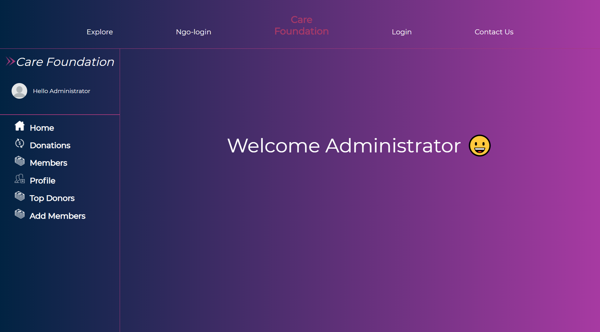
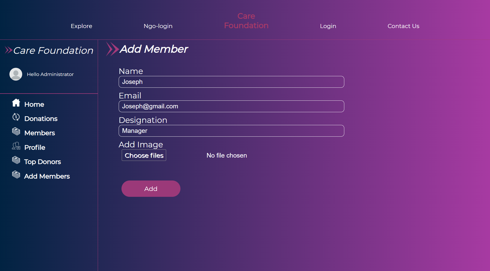
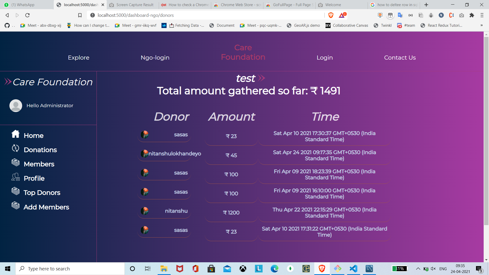
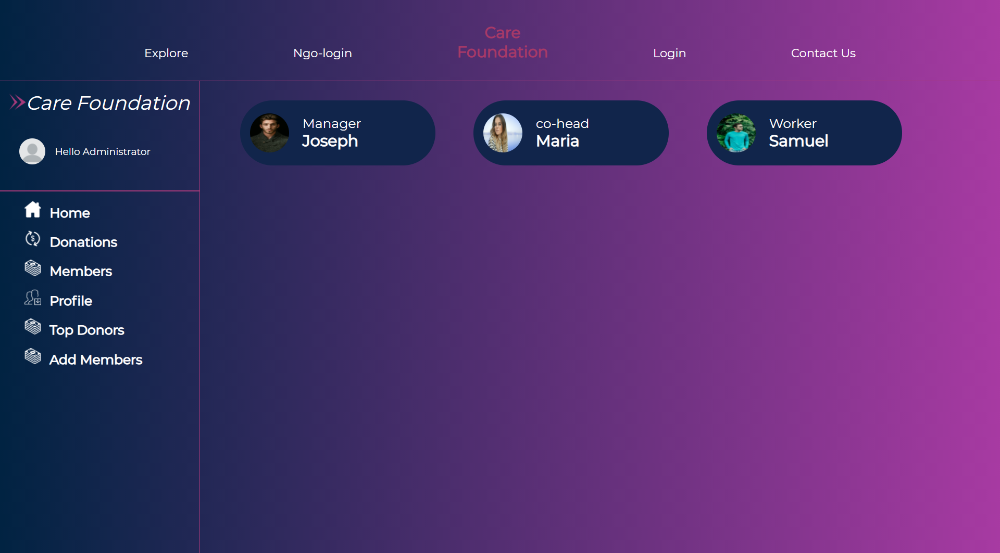
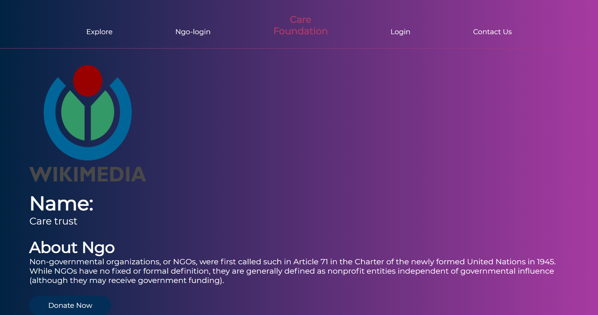
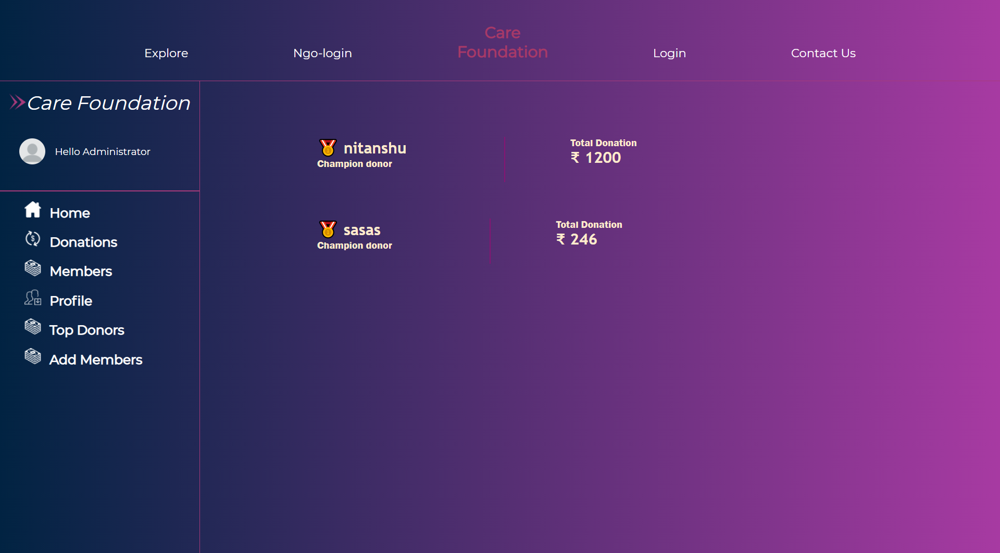

# NGO-Database-Management
App:













follow steps: 

run command 
```bash
git clone https://github.com/Ohh-404-BrainNotFound/NGO-Database-Management-Backend.git
cd NGO-Database-Management-Backend
cp .env.example .env
```
Replace sample credentials with original once

```bash
npm install
node app.js
```

headover to /db to setup data base locally


Enjoy application at http://localhost:3000


